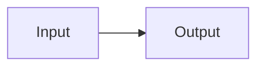
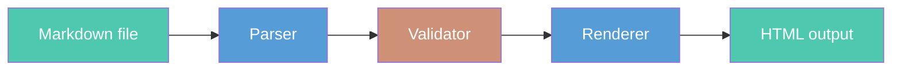

# Presenting with MD-Slides

## The complete feature reference

**MD-Slides v1.0.0**

<!-- Speaker notes: This tour covers every feature in MD-Slides: all six templates, every content type, keyboard navigation, speaker view, CLI commands, themes, configuration, and validation. Two-column slides show the markdown you type on the left and what it renders on the right. Open examples/feature-tour.md alongside this presentation to see exactly what produced each slide. -->

---
template: content
---

## How to read this tour

Every feature is demonstrated by **using it**. Two-column slides show markdown source on the left, the rendered result on the right — nothing else.

**Escaping note:** Slide separators (`---`) cannot appear as bare lines inside code blocks — the parser splits on them before markdown processing. All code examples show slide body content only, omitting the surrounding `---` markers. Open `examples/feature-tour.md` to see the full format.

Seven sections: Templates · Content · Speaker view · Navigation · CLI · Themes · Validation

<!-- Speaker notes: The two-column convention is central to the tour. Left column shows what you type; right column shows only what that produces — no added commentary. The escaping note is important: the parser operates at text level before markdown parsing. See the source file for the actual frontmatter structure with surrounding --- markers. -->

---
template: section-title
---

## Templates

Six slide types — each with named slots and enforced constraints

<!-- Speaker notes: Every slide declares its template in frontmatter. The template determines layout, available slots, and what constraints apply. The surrounding --- that opens and closes frontmatter is the same token that separates slides — there is no separate frontmatter fence syntax. -->

---
template: content
---

## title template

Three slots: H1 title (required, ≤ 2 lines), H2 subtitle (optional, ≤ 2 lines), `**Author**` (optional, ≤ 80 chars).

```markdown
# Main Title
## Optional subtitle
**Optional author**
```

`title` is the only template that uses H1. All other templates use H2. The first slide of this deck uses the `title` template.

<!-- Speaker notes: The title template is used once — for the opening slide. H1 is visually dominant; using it anywhere else would conflict with H2 headings on content slides. The author slot expects bold text rather than a heading. The first slide in any deck must be the title template. -->

---
template: content
---

## content template

The `content` template is the workhorse — most slides use it. Two slots:

```markdown
## Slide Heading

Body: markdown, lists, code blocks, images, tables.
```

Heading: required, ≤ 80 chars. Body: ≤ 12 lines and ≤ 150 words. Validation reports all violations together — you fix everything in one pass, not one at a time.

<!-- Speaker notes: The density limits exist to protect your audience. A slide that exceeds 12 lines typically needs to be split. The 150-word limit prevents walls of text. Both limits are checked together with all violations across all slides reported at once using Either[NonEmptyList[ValidationError], SlideDeck]. -->

---
template: two-column
---

## section-title and closing templates

Open chapters with `section-title`:

```
template: section-title

## Chapter Title

Subtitle text
```

Both parse like `content`. Themes assign each a distinct visual identity.

---column---

End the deck with `closing`:

```
template: closing

## Thank You

Questions welcome
```

Themes can apply full-bleed backgrounds to these templates automatically.

<!-- Speaker notes: The section-title and closing templates parse identically to content, but themes can give each a very different visual appearance — a full-bleed background image, a contrasting color, a large centered title. This is done via templateConfigurations in the theme JSON, not in the slide frontmatter. -->

---
template: content
---

## two-column template

Split a slide into two independent columns using the `---column---` delimiter:

```
template: two-column
## Heading
Left column content here.
---column---
Right column content here.
```

Each column: ≤ 10 lines, ≤ 75 words. The `---column---` delimiter must be on its own line. The next slide demonstrates a live `two-column` layout.

<!-- Speaker notes: Everything before ---column--- is the left column; everything after is the right column. This content slide safely shows ---column--- in a code block because the parser only splits on bare --- lines. The ---column--- delimiter is a content-level token processed after the slide is parsed. -->

---
template: two-column
---

## two-column in action: before and after

**Sequential — simple but slow:**

```scala
def processAll(items: List[Item]): Unit =
  items.foreach(item => process(item))
```

Each item processed one at a time. Fine for small lists; bottleneck at scale.

---column---

**Parallel — Cats Effect:**

```scala
def processAll(items: List[Item]): IO[Unit] =
  items.parTraverse(item => process(item))
```

`parTraverse` runs all items concurrently using the IO thread pool.

<!-- Speaker notes: This is a live two-column slide. The before/after comparison is the most common use case for two-column — sequential vs. parallel, bad vs. good, input vs. output. Both columns have code blocks, body text, and bold headings. -->

---
template: content
---

## diagram template

The `diagram` template renders Mermaid charts to SVG at build time — requires `mmdc` installed.

````
template: diagram
caption: Optional caption
## Slide heading

````

Flowcharts, sequence, class, Gantt, pie, ER, and state diagrams are supported. The next slide is a live `diagram` slide.

<!-- Speaker notes: mmdc (mermaid-cli) must be installed. During render, mmdc converts each mermaid block to an SVG embedded directly in the HTML output. No client-side Mermaid.js is needed. The 4-backtick outer fence above safely contains the inner 3-backtick mermaid fence — this is how to show nested fences in code examples. -->

---
template: diagram
caption: The MD-Slides render pipeline
---

## Mermaid diagram: live render



<!-- Speaker notes: This is a live diagram template slide. The flowchart was rendered server-side by mmdc during the render pass and is embedded as SVG. The caption below the diagram came from the caption: frontmatter key. Node style directives apply fill colors to individual nodes. -->

---
template: content
---

## Frontmatter: complete key reference

Every slide opens with a frontmatter block between `---` markers. Supported keys:

| Key | Required | Description |
|-----|----------|-------------|
| `template:` | yes | Slide type: `title` `content` `section-title` `two-column` `diagram` `closing` |
| `header:` | no | Top bar text — tokens: `{{pageNumber}}` `{{totalPages}}` `{{timer}}` `{{date}}` |
| `footer:` | no | Bottom bar text — same tokens as `header:` |
| `vertical-align:` | no | Content position: `top` `center` (default) `bottom` |
| `background:` | no | Per-slide background image path (overrides theme for this slide only) |
| `caption:` | no | Caption below diagram (`diagram` template only) |

<!-- Speaker notes: The frontmatter block is enclosed in two --- markers — the same --- that separates slides. The first --- is both the slide separator and the frontmatter open; the second --- closes the frontmatter. Keys are case-sensitive and appear one per line with no quotes around values. -->

---
template: section-title
---

## Content

Formatting, lists, code blocks, images, and tables

<!-- Speaker notes: This section demonstrates every content type. All standard CommonMark inline elements work in any template body or column. Block elements include code blocks with syntax highlighting, ordered and unordered lists with nesting, images by path or data URL, and markdown tables. -->

---
template: two-column
---

## Inline formatting: you write / you get

```markdown
**Bold** text
*Italic* text
`Inline code`
[Link text](https://github.com/TJMSolns/MD-Slides)
~~Strikethrough~~
```

---column---

**Bold** text
*Italic* text
`Inline code`
[Link text](https://github.com/TJMSolns/MD-Slides)
~~Strikethrough~~

<!-- Speaker notes: All standard CommonMark inline elements are supported. The same formatting works in title subtitles, content bodies, column content, and speaker notes. The right column is the literal rendered output of the left column's markdown — nothing added or changed. -->

---
template: two-column
---

## Lists: you write / you get

```markdown
- First item
- Second item
  - Nested level 2
    - Nested level 3

1. Ordered first
2. Ordered second
   - Mixed nesting
```

---column---

- First item
- Second item
  - Nested level 2
    - Nested level 3

1. Ordered first
2. Ordered second
   - Mixed nesting

<!-- Speaker notes: Lists support up to 3 levels of nesting. Ordered and unordered lists can be mixed at nested levels. The right column is the rendered output of the left column's markdown. -->

---
template: content
---

## Code blocks: syntax highlighting

Fenced code blocks with a language name get full syntax highlighting:

```scala
case class Slide(id: SlideId, template: Template, slots: Map[SlotName, SlotContent])

object SlideDeck:
  def validated(slides: List[Slide]): Either[NonEmptyList[ValidationError], SlideDeck] =
    Either.cond(
      slides.nonEmpty,
      SlideDeck(slides),
      NonEmptyList.one(ValidationError("Empty deck"))
    )
```

190+ languages via highlight.js. Specify the language immediately after the opening fence: ` ```scala `.

<!-- Speaker notes: This code block is the demonstration — you're looking at syntax-highlighted Scala 3. The language identifier after the opening fence selects the highlighter. highlight.js runs client-side and supports Scala, Java, Python, JavaScript, TypeScript, Bash, SQL, JSON, YAML, and 190+ others. Code blocks auto-scale to fit slide width. -->

---
template: two-column
---

## Code blocks: Python and Bash

```python
def contrast_ratio(fg, bg):
    l1 = luminance(fg)
    l2 = luminance(bg)
    brighter = max(l1, l2)
    darker   = min(l1, l2)
    return (brighter + 0.05) / (darker + 0.05)

# WCAG AA: 4.5:1 for normal text
assert contrast_ratio('#000','#fff') >= 4.5
```

---column---

```bash
# Download the JAR
curl -L https://github.com/TJMSolns/\
  MD-Slides/releases/latest/\
  download/md-slides.jar \
  -o md-slides.jar

# Render with dark theme
java -jar md-slides.jar \
  render my-talk --theme dark
```

<!-- Speaker notes: Any language supported by highlight.js works — just use the correct identifier after the opening fence. Python and Bash are shown here side by side because they appear frequently in presentations about tools and algorithms. Both columns are purely code — no added explanatory text. -->

---
template: two-column
---

## Images: you write / you get

```markdown

```

Path is relative to the `.md` source file. MD-Slides copies images to the output directory automatically.

**Alt text is required** — missing alt text is a WCAG 2.1 validation error.

For self-contained files: ``

---column---


<!-- Speaker notes: Local images are copied to the output directory during render. Base64 data URLs are embedded inline — this feature-tour.md is fully self-contained because the logo uses a data URL. The right column shows only the rendered image — the exact output of the markdown on the left. Alt text is validated against WCAG 2.1. -->

---
template: two-column
---

## Tables: you write / you get

```markdown
| Template | Max body | Used for |
|----------|----------|----------|
| `title` | — | Opening slide |
| `content` | 12 ln / 150 w | Most slides |
| `two-column` | 10 ln / 75 w | Comparisons |
| `diagram` | — | Mermaid charts |
| `closing` | 12 ln / 150 w | Final slide |
```

Column alignment: `|:---:|` center · `|---:|` right

---column---

| Template | Max body | Used for |
|----------|----------|----------|
| `title` | — | Opening slide |
| `content` | 12 ln / 150 w | Most slides |
| `two-column` | 10 ln / 75 w | Comparisons |
| `diagram` | — | Mermaid charts |
| `closing` | 12 ln / 150 w | Final slide |

<!-- Speaker notes: Tables render as semantic HTML with thead and tbody. Inline code, bold, and links all work inside cells. Tables count against body density limits. The right column is the exact rendered output of the table markdown on the left — nothing added. -->

---
template: content
background: data:image/svg+xml;base64,PHN2ZyB4bWxucz0iaHR0cDovL3d3dy53My5vcmcvMjAwMC9zdmciIHdpZHRoPSIxIiBoZWlnaHQ9IjEiPjxyZWN0IGZpbGw9IiMxYTNhNWMiIHdpZHRoPSIxIiBoZWlnaHQ9IjEiLz48L3N2Zz4=
---

## Per-slide background image

This slide uses a background image set in frontmatter — the dark blue behind this text came from:

```
template: content
background: images/dark-blue.png
```

Per-slide `background:` takes an image path. It overrides the theme background for this slide only. Supports any browser-renderable format: PNG, JPEG, SVG, WebP.

<!-- Speaker notes: The dark blue background on this slide came from the background: frontmatter key — it's a 1x1 dark blue SVG encoded as a base64 data URL. In a real presentation you'd point to a local file: background: images/bg.jpg. Per-slide backgrounds are useful for emphasis slides. They override only this slide; all other slides use the theme background. -->

---
template: section-title
---

## Speaker View

Notes, next-slide preview, and elapsed timer

<!-- Speaker notes: Speaker view opens in a separate window synchronized to the main presentation via BroadcastChannel. The speaker window shows: current slide (small preview), next slide heading, speaker notes for the current slide, and an elapsed timer. Navigation in either window keeps both in sync. -->

---
template: two-column
---

## Speaker notes: you write / you get

```markdown
<!-- Speaker notes: Key point here.
Don't forget to mention Y.
Notes can span multiple lines. -->
```

Place the comment anywhere in the slide body. Press **S** to open speaker view.

---column---

**In speaker view, you see:**

- Current slide (small preview)
- Next slide heading
- Your notes for the current slide
- Elapsed timer

Notes are **never** visible in the main window.

<!-- Speaker notes: You found the speaker notes. This is what appears in speaker view — only you see this. The audience sees only the slide content. The left column shows the exact HTML comment syntax; the right column describes where notes appear. -->

---
template: content
---

## Speaker view layout and timer

The speaker window shows four panels:

1. **Current slide** — small preview of what the audience sees
2. **Next slide heading** — so you can bridge transitions smoothly
3. **Speaker notes** — your notes for this slide
4. **Elapsed timer** — tracks time from first navigation

Timer controls: **T** pauses/resumes · **R** resets to 00:00:00. Use `{{timer}}` in headers or footers to display the live value on slides.

<!-- Speaker notes: The speaker view timer is separate from the header/footer display but shows the same value. Press T to pause without entering break mode. Press R when rehearsing. The timer starts on first arrow-key or space navigation, not on page load. -->

---
template: section-title
---

## Navigation

Every keyboard shortcut

<!-- Speaker notes: MD-Slides provides a complete keyboard-driven navigation model. Arrow-key navigation, speaker view, break mode, direct-jump goto, browser-like history, and timer controls — all without touching the mouse. -->

---
template: content
---

## Keyboard shortcuts — complete reference

| Key | Action |
|-----|--------|
| `→` / `Space` | Next slide |
| `←` | Previous slide |
| `Home` / `End` | First / last slide |
| `S` | Open speaker view |
| `B` | Toggle break mode |
| `G` | Goto: type slide number, press Enter |
| `P` / `N` | History back / forward |
| `T` / `R` | Pause / reset timer |

All shortcuts work in the main window and in speaker view.

<!-- Speaker notes: Arrow keys and Space are the primary navigation. S opens speaker view in a new window — position it on your laptop while projecting the main view. B hides slides from the audience. P and N provide browser-like history navigation ideal for Q&A sessions where you jump around non-linearly. -->

---
template: content
---

## Break mode and goto

**Break mode (B):** Hides the presentation from the audience while you take a break. The timer pauses automatically. Press B again to resume. Configure a custom break screen image in your theme JSON.

**Goto (G):** Press G, type a slide number, press Enter. Jumps directly to that slide — 1-indexed, matching the slide counter.

**History navigation (P/N):**
- `P` — back through your navigation history (not just previous numbered slide)
- `N` — forward through history, or next slide if no forward history

<!-- Speaker notes: Break mode is essential for Q&A sessions. While the audience sees the break screen, you still see your current slide and notes in speaker view. The history stack records your full navigation path — P takes you back through your actual path. Goto is invaluable when someone asks 'can you go back to slide 12?' -->

---
template: section-title
---

## CLI Commands

render, display, report, config, and smart default

<!-- Speaker notes: MD-Slides has four CLI usage patterns. render is the core command. display adds session logging. report analyzes past sessions. config shows the merged configuration. The smart default picks render or display automatically based on context. -->

---
template: two-column
---

## render: markdown to HTML

```bash
java -jar md-slides.jar render my-talk
java -jar md-slides.jar render my-talk \
  --theme dark
```

Output: a `my-talk/` directory with `index.html`, `speaker.html`, and copied image assets.

Path flexibility: `my-talk`, `my-talk.md`, and `talks/my-talk` all resolve correctly.

---column---

```
my-talk/
  index.html      ← main presentation
  speaker.html    ← speaker view
  images/         ← copied assets
```

Validates first — all errors shown together. No output is written until every slide passes.

<!-- Speaker notes: The render command validates first. If validation fails, all errors are printed together and nothing is written. The output directory is created if it doesn't exist. Existing output is overwritten without warning. -->

---
template: content
---

## render: all flags

| Flag | Default | Purpose |
|------|---------|---------|
| `--theme THEME` | `light` | Built-in name or path to `theme.json` |
| `--no-copy-images` | copy on | Skip copying image assets to output |
| `--skip-accessibility` | check on | Skip WCAG 2.1 AA validation |
| `--accessibility-report FILE` | off | Write validation results to JSON |
| `--break-screen IMAGE` | none | Image shown during break mode (B) |
| `-i FILE` / `-o DIR` | — | Explicit input / output paths |

Use `--theme ./path/to/theme.json` to load a custom theme by file path.

<!-- Speaker notes: The -i/-o form is useful when input and output directories don't share a name. --accessibility-report writes a structured JSON file suitable for CI checks. --break-screen sets the image displayed to the audience while break mode is active. -->

---
template: content
---

## config command

```bash
java -jar md-slides.jar config
```
```
CLI: (no overrides)
Project (.mdslides/config.json): theme=dark
Global (~/.mdslides/config.json): (not set)
Merged: theme=dark, copyImages=true
```

Useful for diagnosing unexpected rendering — shows exactly which settings are in effect and where they came from across all four configuration layers.

<!-- Speaker notes: The config command is a diagnostic tool. When something renders unexpectedly, run config to see which settings are active and where they came from. The four-layer merge means a project config can override your personal global config, and a CLI flag overrides both. -->

---
template: two-column
---

## display and report: tracked sessions

```bash
# Open with session logging
java -jar md-slides.jar display my-talk
```

Writes events to `my-talk/deck.log`:
- Navigation events with method
- Timer start / pause / resume
- Break mode toggles
- Session start and end

---column---

```bash
# After presenting, analyze
java -jar md-slides.jar report my-talk
```

Report shows:
- Total time (excl. breaks)
- Per-slide time spent
- Navigation path taken
- Break durations

Review after each talk to improve pacing.

<!-- Speaker notes: The display command is identical to render but enables session logging. The report command reads the log and generates analytics. Over multiple presentations you can track improvement in pacing and identify which slides consistently run long. -->

---
template: content
---

## Smart default: no subcommand needed

MD-Slides infers what you want from context:

```bash
java -jar md-slides.jar my-talk           # → render
java -jar md-slides.jar my-talk.md        # → render
java -jar md-slides.jar my-talk --display # → display
```

If the output directory already contains `deck.log`, the smart default switches to `display` automatically — it assumes you're re-presenting an existing deck, not doing a first render.

<!-- Speaker notes: The smart default reduces friction for the common case. The --display flag explicitly opts into session logging. The auto-detection based on deck.log is a convenience for repeat presentations of the same deck. -->

---
template: two-column
---

## Distributing your presentation

The output directory is **self-contained**:

```bash
# Web server
scp -r my-talk/ user@server:/var/www/html/

# GitHub Pages
# Push my-talk/ to docs/ or gh-pages branch

# Email: zip the folder
zip -r my-talk.zip my-talk/
```

`index.html` opens in any browser — no server required.

---column---

**PDF export — browser print:**

1. Open `my-talk/index.html`
2. File → Print (Ctrl/Cmd + P)
3. Destination → Save as PDF
4. Print

Or with headless Chrome:

```bash
chromium --headless \
  --print-to-pdf=my-talk.pdf \
  my-talk/index.html
```

Speaker notes are in `speaker.html` — not included in the PDF.

<!-- Speaker notes: The output is deliberately self-contained — index.html, speaker.html, and all assets in one directory that works without a server. For GitHub Pages, put the output in a docs/ folder or gh-pages branch. PDF via browser print is simplest; headless Chrome gives more control over page size and margins. -->

---
template: two-column
---

## Fullscreen and browser tips

**Go fullscreen during your presentation:**

- **F11** (Windows/Linux) or **Ctrl+Cmd+F** (Mac) — browser fullscreen
- **F** in some browsers — presentation mode

All MD-Slides keyboard shortcuts continue to work in fullscreen mode.

**Recommended:** Chrome or Firefox — both support BroadcastChannel for speaker view sync.

---column---

**Opening speaker view:**

1. Press **S** in the main window
2. A new window opens — drag it to your laptop screen
3. Navigate from either window — both stay synchronized

**If speaker view won't open:** popup blockers may block `file://` URLs. Fix with a local server:

```bash
python3 -m http.server 8080
# open http://localhost:8080/my-talk/
```

<!-- Speaker notes: Browser popup blockers can prevent the speaker view window from opening on file:// URLs. The simplest fix is a local HTTP server — python3 -m http.server avoids the file:// restriction. Alternatively, allow popups for the file:// origin in your browser settings. -->

---
template: section-title
---

## Themes and Configuration

Built-in themes, custom JSON themes, and four-layer config

<!-- Speaker notes: MD-Slides ships with two themes — light and dark. Custom themes are JSON files that override any visual property. Configuration is layered: CLI flags override project config, which overrides global config, which overrides built-in defaults. -->

---
template: content
---

## Built-in themes: light and dark

```bash
java -jar md-slides.jar render my-talk --theme light  # default
java -jar md-slides.jar render my-talk --theme dark
```

**light** — white background, dark text, blue accents. Clean and professional for most venues.

**dark** — dark background, light text, teal accents. High contrast for dark rooms and screen sharing.

Both themes pass WCAG 2.1 AA contrast requirements. This deck is rendered with the `dark` theme.

<!-- Speaker notes: The light theme is the default when no theme is specified. The dark theme is recommended for conference rooms with poor lighting or for screen-sharing where a dark background reads better on compressed video. Both themes apply consistent syntax highlighting, slide counters, and speaker view styling. -->

---
template: content
---

## Theme backgrounds: color and image

Deck-wide backgrounds are set in the theme JSON:

```json
"background": { "color": "#1e1e1e" }
```

Or with a full-bleed image: `"background": { "image": "images/deck-bg.jpg" }`

Per-template backgrounds override the deck default for specific slide types. Per-slide `background:` frontmatter overrides everything.

Priority: per-slide frontmatter > per-template JSON > deck-wide theme > none

<!-- Speaker notes: Background configuration has three tiers. The deck-wide background in the theme JSON sets the default for all slides. Per-template configuration in templateConfigurations overrides that for specific slide types — section-title and closing templates commonly have their own backgrounds. Per-slide background: frontmatter is the override of last resort for individual emphasis slides. -->

---
template: two-column
---

## Custom themes: JSON structure

```json
{
  "name": "mytheme",
  "colors": { "text": "#333", "accent": "#06c" },
  "fonts": { "body": "Arial", "code": "monospace" },
  "background": { "color": "#fff" }
}
```

Save as `mytheme/theme.json`. Use with `--theme ./mytheme/theme.json`.

---column---

```json
{
  "syntax": { "keyword": "#00f", "string": "#0a0" },
  "slideCounter": { "color": "#666" },
  "spacing": { "slideMargin": "2rem", "lineHeight": "1.6" },
  "breakScreen": "images/break.png"
}
```

Only include keys you want to change — everything else falls back to built-in defaults.

<!-- Speaker notes: Custom themes override any visual property. The left column shows the core keys; the right shows the optional sections. You only need to specify what you want to change. The breakScreen path in the theme is the default break image; it can be overridden per-render with --break-screen. -->

---
template: two-column
---

## Per-template configuration in themes

```json
"templateConfigurations": [
  {
    "template": "section-title",
    "background": { "image": "section-bg.png" },
    "header": "{{pageNumber}}/{{totalPages}}"
  },
  {
    "template": "closing",
    "background": { "color": "#111" }
  }
]
```

---column---

| Key | Effect |
|-----|--------|
| `template` | Which slide type this applies to |
| `background` | Color or image for this template |
| `header` | Header text with token support |
| `footer` | Footer text with token support |

Every slide of that type gets this configuration automatically — no per-slide frontmatter needed.

<!-- Speaker notes: templateConfigurations is the primary way to give a theme a distinct visual identity per section. A common pattern: section-title slides have a full-bleed background that signals a major transition; closing slides are branded. This is all JSON configuration — no code required. -->

---
template: content
header: Feature Tour — Slide {{pageNumber}} of {{totalPages}}
---

## Per-slide header and footer: live demo

This slide carries a `header:` key in its frontmatter:

```
template: content
header: Feature Tour — Slide {{pageNumber}} of {{totalPages}}
```

Look at the top of this slide — the header is rendered there with `{{pageNumber}}` and `{{totalPages}}` resolved to real values. The same works for `footer:`. Per-slide frontmatter overrides the theme for that one slide.

<!-- Speaker notes: The header at the top of this slide came from frontmatter, not from the theme. This is the most direct way to demonstrate the feature — the slide itself is the demo. Available tokens: pageNumber, totalPages, timer, date. The theme sets default headers and footers; per-slide frontmatter overrides them for individual slides. -->

---
template: content
---

## Vertical alignment

Content position per slide via frontmatter:

```
template: content
vertical-align: top
```

Three options: `top` · `center` (default) · `bottom`

Useful for sparse slides where centered text looks visually unbalanced, or for slides with code blocks that benefit from a predictable top position.

<!-- Speaker notes: Vertical alignment affects the main content area only. Headers and footers are positioned independently. The center default works well for most slides. Use top for slides with code blocks or large tables where a fixed top position aids readability. -->

---
template: content
---

## Four-layer configuration

Settings applied in priority order (highest wins):

1. **CLI flags** — `--theme dark`, `-o dist`
2. **Project config** — `.mdslides/config.json` committed with your repo
3. **Global config** — `~/.mdslides/config.json` personal preferences
4. **Built-in defaults** — always present as the base

```json
{ "theme": "dark", "outputDir": "dist" }
```

Commit project config so everyone on the team renders with the same theme.

<!-- Speaker notes: The four-layer hierarchy solves a real problem: team-wide defaults (project config), personal overrides (global config), and per-run overrides (CLI flags). A conference organizer can commit a project config with the house theme so every speaker gets it automatically. Run 'java -jar md-slides.jar config' to see the merged result. -->

---
template: section-title
---

## Validation

All errors collected and shown together

<!-- Speaker notes: MD-Slides validates every slide before rendering anything. Rather than stopping at the first error, it collects all validation errors using Either[NonEmptyList[ValidationError], SlideDeck] and reports them together. You see every problem in one pass and can fix them all before running again. -->

---
template: content
---

## What gets validated

MD-Slides checks every slide before rendering:

**Structure:** required slots present, template declared, frontmatter well-formed

**Density:** heading ≤ 80 chars; body ≤ 12 lines and 150 words; columns ≤ 10 lines and 75 words

**Accessibility:** images have alt text; contrast ratios meet WCAG 2.1 AA

**Template rules:** title H1 ≤ 2 lines; subtitle ≤ 2 lines; author ≤ 80 chars; two-column has exactly one `---column---`

<!-- Speaker notes: Validation is not optional — every render runs all checks. The --skip-accessibility flag bypasses WCAG contrast checks only, not structural or density validation. You always get feedback on content density before the audience sees your slides. -->

---
template: content
---

## Validation output: all errors at once

```
✗ Validation failed:
  - Slide 3: body exceeds max 12 lines (has 17)
  - Slide 5: heading exceeds max 80 characters (has 94)
  - Slide 7: image is missing alt text
  - Slide 12: two-column left exceeds max 10 lines (has 13)
```

Fix all of them, then render again. No output is written until every slide passes.

The domain model uses `Either[NonEmptyList[ValidationError], SlideDeck]` — errors accumulate rather than short-circuit. An empty error list is a type-level impossibility.

<!-- Speaker notes: The error accumulation design is deliberate. Stopping at the first error means a loop: fix, render, find next error, fix, render. Showing everything at once respects your time. The NonEmptyList guarantee means a Left always has at least one error — a structural contract, not just a convention. -->

---
template: closing
---

## MD-Slides

Markdown → self-contained HTML presentations

**Open the source.** `examples/feature-tour.md` produced every slide in this deck.

<!-- Speaker notes: Start your own deck: java -jar md-slides.jar render my-talk --theme light. The feature-tour.md file is the single authoritative source for this presentation — it exercises every template, every content type, every keyboard shortcut, and every configuration option. -->
