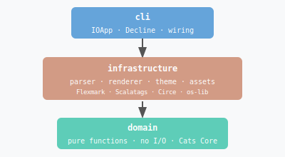

# MD-Slides Feature Tour

## Every feature, one deck

**MD-Slides v1.0.0**

<!-- Speaker notes: Welcome to the feature tour. This presentation exercises every template, every content element, and every interactive feature in MD-Slides. Open it with: java -jar md-slides.jar render examples/feature-tour --theme dark -->

---
template: section-title
---

## Part 1

Templates

<!-- Speaker notes: MD-Slides has six templates: title, content, section-title, two-column, closing, and diagram. You just saw the title template. This is a section-title. Let's walk through the rest. -->

---
template: content
---

## The content template

This is the workhorse — used for most slides.

The **body slot** supports full Markdown:

- **Bold** with `**double asterisks**`
- *Italic* with `*single asterisks*`
- `Inline code` with backticks
- [Links](https://github.com/TJMSolns/MD-Slides) with `[text](url)`
- ~~Strikethrough~~ with `~~tildes~~`

<!-- Speaker notes: The content template enforces readability constraints: heading max 80 chars, body max 12 lines and 150 words. These aren't arbitrary — they exist because dense slides lose audiences. -->

---
template: content
---

## Lists: ordered and unordered

**Unordered list** — bullet items, max 2 levels of nesting:

- First item
- Second item
  - Nested item (max 2 levels deep)
  - Another nested item
- Third item

**Ordered list** — numbered steps:
1. Download `md-slides.jar`
2. Write slides in Markdown
3. Run `java -jar md-slides.jar render my-talk`

<!-- Speaker notes: Lists are the most common body element. MD-Slides supports nesting up to two levels deep — enough for any presentation, not so much that it encourages wall-of-text slides. -->

---
template: content
---

## Code blocks with syntax highlighting

Fenced code blocks get automatic syntax highlighting via highlight.js (190+ languages):

```scala
case class Slide(
  id: SlideId,
  template: String,
  slots: Map[String, String]
)

val validated: Either[NonEmptyList[ValidationError], Slide] =
  Slide.validated(id, "content", slots)
```

Language hint controls the highlighter: `` ```scala ``, `` ```python ``, `` ```bash ``, etc.

<!-- Speaker notes: The language hint after the opening fence is optional but recommended. Without it highlight.js will auto-detect, which works well for most languages but is less reliable for short snippets. -->

---
template: content
---

## Code blocks: multiple languages

```python
def render(slides: list[Slide]) -> str:
    return "\n".join(
        f"<section>{slide.render()}</section>"
        for slide in slides
        if slide.is_valid()
    )
```

```bash
# Render with a custom theme
java -jar md-slides.jar render my-talk --theme ./themes/mytheme/theme.json

# Open in browser immediately
java -jar md-slides.jar display my-talk
```

<!-- Speaker notes: 190+ languages are supported. Common ones: scala, python, javascript, typescript, java, go, rust, bash, sql, json, yaml, xml, html, css. -->

---
template: two-column
---

## Two-column layout

**Left column** is for one side.
Use it for comparisons, pros/cons,
before/after, or parallel concepts.

- Pros, options, before
- First approach
- Original state

---column---

**Right column** is for the other.
The delimiter `---column---` splits
content at that exact line.

- Cons, alternatives, after
- Second approach
- Desired state

<!-- Speaker notes: The two-column template splits content at the ---column--- delimiter. Both columns are validated independently — each has its own line and word count limits. The split is always 50/50. -->

---
template: content
---

## Images

Images use standard Markdown syntax and are automatically copied to the output directory:


```markdown


```

Supported sources: **local paths** (recommended), **external URLs**, **data URLs**.

<!-- Speaker notes: Alt text is not optional — MD-Slides will fail validation on images without descriptive alt text. This is an accessibility requirement, not a style guide. Empty alt text  is also rejected. -->

---
template: content
---

## Images: architecture diagram

Diagrams rendered as SVG scale cleanly at any resolution:


<!-- Speaker notes: Because SVGs are vector, they look sharp on both laptop screens and projectors. PNG and JPEG work too — MD-Slides copies them to the output directory and rewrites paths in the generated HTML. -->

---
template: section-title
---

## Part 2

Speaker view & navigation

---
template: content
---

## Speaker view

Press **S** during any presentation to open the speaker window:

- Current slide with your **speaker notes** visible
- **Next slide** heading as a preview
- **Elapsed timer** that starts on first navigation

Two windows stay **synchronized** — navigate from either one.

Workflow: open `index.html` on the projector, `speaker.html` on your laptop.

<!-- Speaker notes: You are reading this in speaker view right now. The timer started when you first pressed an arrow key. The next slide preview is shown below. Navigate from either window and both stay in sync via localStorage events. -->

---
template: content
---

## Adding speaker notes

Speaker notes are HTML comments — invisible in the presentation, visible in speaker view:

```markdown
---
template: content
---

## My Slide Heading

Body content goes here.

<!-- Speaker notes: These are my notes. Only I can see them.
     They can span multiple lines.
     Markdown is not rendered here — plain text only. -->
```

Notes can appear anywhere in the slide body, but convention is at the end.

<!-- Speaker notes: Every slide in this deck has speaker notes. Scroll back through the deck in speaker view to see them. The format is a standard HTML comment so it doesn't affect any Markdown renderer you might use to preview the source file. -->

---
template: section-title
---

## Part 3

Themes & configuration

---
template: content
---

## Built-in themes

Two themes ship with MD-Slides:

```bash
# Light theme (default)
java -jar md-slides.jar render my-talk --theme light

# Dark theme
java -jar md-slides.jar render my-talk --theme dark
```

This presentation is rendering under the theme you passed at the command line. Try re-rendering with the other theme to compare.

<!-- Speaker notes: The default is light. Both themes are designed for high contrast and readability at presentation distances. The dark theme is particularly well-suited for low-light rooms. -->

---
template: content
---

## Custom themes

Create a `theme.json` file anywhere and point to it:

```bash
java -jar md-slides.jar render my-talk --theme ./themes/mytheme/theme.json
```

Optional per-template background images:

```json
{
  "templateBackgrounds": {
    "title": "backgrounds/title-page.png",
    "content": "backgrounds/content-page.png",
    "section-title": "backgrounds/section-page.png"
  }
}
```

See `docs/decisions/pdr/PDR-007-theme-schema.md` for the full schema.

<!-- Speaker notes: The templateBackgrounds feature lets you use brand background images from a corporate slide deck template — just export the backgrounds as PNGs and reference them in your theme.json. -->

---
template: content
---

## Configuration: 4-layer precedence

Settings are resolved from highest to lowest priority:

1. **CLI flag**: `--theme dark` — overrides everything
2. **Project config**: `.mdslides/config.json` — committed with your repo
3. **Global config**: `~/.mdslides/config.json` — personal preferences
4. **Built-in defaults**: `theme: light`

Example project config:

```json
{
  "theme": "dark",
  "outputDir": "dist"
}
```

<!-- Speaker notes: The project config is the most useful layer for teams — commit a .mdslides/config.json so everyone on the team gets the same defaults without needing to remember CLI flags. The global config is for personal overrides like preferring dark mode. -->

---
template: section-title
---

## Part 4

Validation

---
template: content
---

## What MD-Slides validates

MD-Slides checks every slide before rendering — **all errors collected at once**:

**Structure:** valid template name · required slots present · 1–200 slides per deck

**Content:** heading max 1 line / 80 chars · body max 12 lines / 150 words · title max 2 lines

**Accessibility:** images must have non-empty descriptive alt text

Errors are always **collected together** — fix everything in one pass, not one error at a time.

<!-- Speaker notes: The key design decision here is error accumulation — all validation errors are collected and reported together, not one at a time. This comes from the Either[NonEmptyList[ValidationError], A] pattern in the domain. You fix everything in one pass. -->

---
template: content
---

## Validation output

If your deck has problems, MD-Slides reports them all at once:

```
✗ Validation failed:
  - Slide 3: body exceeds max 12 lines (has 17)
  - Slide 5: heading exceeds max 80 characters (has 94)
  - Slide 7: image missing alt text
```

Fix everything in one pass — no repeated runs to discover the next error.

This comes from `Either[NonEmptyList[ValidationError], A]` in the domain: validation never short-circuits.

<!-- Speaker notes: This is the practical benefit of the pure functional validation pipeline: because validation never short-circuits, you always get a complete picture of what needs fixing. Other tools stop at the first error and make you run repeatedly. -->

---
template: closing
---

## That's the full tour

All six templates. Every content element.
Speaker view. Themes. Configuration. Validation.

**Start writing:**

```bash
java -jar md-slides.jar render examples/feature-tour --theme dark
```

[github.com/TJMSolns/MD-Slides](https://github.com/TJMSolns/MD-Slides)

<!-- Speaker notes: Everything you've seen in this deck is defined in examples/feature-tour.md — plain Markdown you can read, copy from, and modify. The source is the documentation. -->
