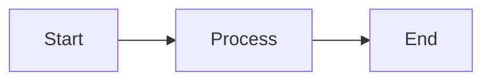
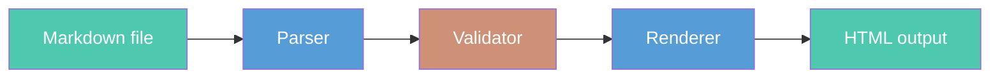
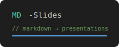

# Presenting with MD-Slides

## The complete feature reference

**MD-Slides v1.0.0**

<!-- Speaker notes: This tour covers every feature in MD-Slides: all six templates, every content type, keyboard navigation, speaker view, CLI commands, themes, configuration, and validation. Two-column slides throughout show the markdown you type on the left and what it renders to on the right. Open examples/feature-tour.md in a text editor alongside this presentation — you'll see exactly what produced each slide. -->

---
template: content
---

## How to read this tour

Every feature is demonstrated by **using it**. Two-column slides show the markdown source on the left and the rendered result on the right.

**Escaping note:** Slide separators (`---`) cannot appear as bare lines inside code blocks — the parser would split on them. All code examples omit the surrounding `---` markers. Open `examples/feature-tour.md` to see the full source format.

Seven sections: Templates · Content · Speaker view · Navigation · CLI · Themes & config · Validation

<!-- Speaker notes: The two-column convention is used throughout: left column shows the markdown you type, right column shows what that markdown renders to. This makes the feature tour self-documenting — you can read the source file and see exactly what each construct produces. The escaping note is important: the MD-Slides parser splits files on exact --- lines before markdown processing, so code blocks that contain --- would corrupt the slide structure. -->

---
template: section-title
---

## Templates

Six slide types — each with named slots and enforced constraints

<!-- Speaker notes: Every slide declares its template in frontmatter. The template determines which slots are available, what content is required, and what the rendered layout looks like. The surrounding --- markers that open and close frontmatter blocks are the same --- that separates slides — there is no separate frontmatter fence. -->

---
template: two-column
---

## title template: source and constraints

```
template: title

# Main Title
   required · max 2 lines

## Subtitle
   optional · max 2 lines

**Author**
   optional · max 80 chars
```

---column---

`H1` headings are used **only** in the `title` template. All other templates use `H2`.

The author slot expects `**bold text**`, not a heading.

The first slide of this deck uses the `title` template — scroll back to see it.

<!-- Speaker notes: The title template is the only template where H1 is used. All other templates use H2 for headings. The author slot expects bold text rather than a heading. Density limits on the title template are more relaxed than content — it's designed for large, readable text only. -->

---
template: two-column
---

## content template: source and constraints

```
template: content

## Heading
   required · max 1 line · max 80 chars

Body goes here.
   required · max 12 lines · max 150 words
```

---column---

`content` is the workhorse — used for most slides.

Density limits exist so your audience can actually read what you write. The validator reports **all violations at once** — you fix everything in one pass.

*This slide is a `content` template.*

<!-- Speaker notes: The 12-line and 150-word limits are design guardrails. Slides that exceed them typically need to be split. The validator accumulates all errors using Either[NonEmptyList[ValidationError], SlideDeck] — you see every problem at once, not one at a time. -->

---
template: content
---

## section-title and closing

Two templates for visual rhythm and transitions:

```
template: section-title

## Part Two: Content

Formatting, lists, code, and images
```

```
template: closing

## Thanks for watching

Questions welcome
```

Both parse identically to `content`. Use `section-title` to open chapters, `closing` to end the deck.

<!-- Speaker notes: The section-title template renders with a distinct visual treatment — typically a full-bleed background color or image — that signals a major transition. The closing template does the same for the final slide. Both are good hooks for per-template background images in a custom theme. -->

---
template: content
---

## two-column template

Split a slide into two independent columns with the `---column---` delimiter:

```
template: two-column

## Heading

Left column content here.

---column---

Right column content here.
```

Each column: max 10 lines, max 75 words. The `---column---` delimiter must appear on its own line.

<!-- Speaker notes: Everything before ---column--- is the left column; everything after is the right column. This slide is a content template, so ---column--- in the code block is safe — it's just text. The next slide is an actual two-column slide. -->

---
template: two-column
---

## two-column in action: before / after

**Sequential — simple but slow:**

```scala
def processAll(items: List[Item]): Unit =
  items.foreach(item => process(item))
// O(n), no parallelism
```

Each item processed one at a time. Fine for small lists; a bottleneck at scale.

---column---

**Parallel — Cats Effect:**

```scala
def processAll(items: List[Item]): IO[Unit] =
  items.parTraverse(item => process(item))
// concurrent via IO thread pool
```

`parTraverse` runs all items concurrently using the effect system's thread pool.

<!-- Speaker notes: This is a live two-column slide. Left shows sequential processing, right shows the parallel equivalent using Cats Effect parTraverse. The two-column layout is ideal for before/after comparisons like this. -->

---
template: content
---

## diagram template

The `diagram` template renders Mermaid charts and graphs at full width:

```
template: diagram
caption: Optional caption below the diagram

## Heading


```

Supports: flowcharts, sequence diagrams, class diagrams, Gantt charts, pie charts, ER diagrams, state diagrams. The next slide is an actual `diagram` slide.

<!-- Speaker notes: The diagram template uses mermaid-cli (mmdc) to pre-render diagrams server-side to SVG during the render pass. The rendered SVG is embedded directly in the HTML output. If mmdc is not installed, diagrams fall back to showing the mermaid source as a code block. No client-side Mermaid.js is needed in the output. -->

---
template: diagram
caption: The MD-Slides render pipeline
---

## Mermaid diagram: live render



<!-- Speaker notes: This is a live diagram template slide. The flowchart above was rendered server-side by mermaid-cli during the render pass and is embedded as SVG. The caption below the diagram came from the caption: frontmatter key. The style directives apply fill colors to individual nodes. -->

---
template: content
---

## Frontmatter: complete key reference

Every slide opens with a frontmatter block between `---` markers. Supported keys:

| Key | Required | Description |
|-----|----------|-------------|
| `template:` | yes | Slide type: `title` `content` `section-title` `two-column` `diagram` `closing` |
| `header:` | no | Top bar text — tokens: `{{pageNumber}}` `{{totalPages}}` `{{timer}}` `{{date}}` |
| `footer:` | no | Bottom bar text — same tokens as `header:` |
| `vertical-align:` | no | Content position: `top` `center` (default) `bottom` |
| `background:` | no | Per-slide background image path (overrides theme for this slide only) |
| `caption:` | no | Caption below the diagram (`diagram` template only) |

<!-- Speaker notes: The frontmatter block is enclosed in two --- markers — the same --- that separates slides. The first --- is both the slide separator and the frontmatter open; the second --- closes the frontmatter. Keys are case-sensitive and must appear one per line with no quotes around values. -->

---
template: section-title
---

## Content

Formatting, lists, code blocks, images, and tables

<!-- Speaker notes: This section demonstrates every content type. All standard CommonMark inline elements work in any template body or two-column column. Block elements include code blocks with syntax highlighting, ordered and unordered lists with nesting, images by path or data URL, and markdown tables. -->

---
template: two-column
---

## Inline formatting: you write / you get

```markdown
**Bold** text
*Italic* text
`Inline code`
[Link text](https://example.com)
~~Strikethrough~~
```

All standard CommonMark. Work in body, columns, and headings.

---column---

**Bold** text
*Italic* text
`Inline code`
[Link text](https://github.com/TJMSolns/MD-Slides)
~~Strikethrough~~

The left shows the markdown you type. The right column is that same markdown rendered.

<!-- Speaker notes: All standard CommonMark inline elements are supported. The same formatting works in title subtitles, content bodies, column content, and speaker notes (though notes are plain text in the speaker view panel). -->

---
template: two-column
---

## Lists: you write / you get

```markdown
- First item
- Second item
  - Nested level 2
    - Nested level 3

1. Ordered first
2. Ordered second
   - Mixed nesting
```

---column---

- First item
- Second item
  - Nested level 2
    - Nested level 3

1. Ordered first
2. Ordered second
   - Mixed nesting

<!-- Speaker notes: Lists support up to 3 levels of nesting. Ordered and unordered lists can be mixed at nested levels. List style (disc, circle, square) is controlled by theme CSS. -->

---
template: content
---

## Code blocks: syntax highlighting

Fenced code blocks with a language name get full syntax highlighting. Specify the language immediately after the opening triple backtick:

```scala
case class Slide(id: SlideId, template: Template, slots: Map[SlotName, SlotContent])

object SlideDeck:
  def validated(slides: List[Slide]): Either[NonEmptyList[ValidationError], SlideDeck] =
    Either.cond(
      slides.nonEmpty,
      SlideDeck(slides),
      NonEmptyList.one(ValidationError("Empty deck"))
    )
```

190+ languages supported via highlight.js.

<!-- Speaker notes: This code block is the demonstration — you're looking at syntax-highlighted Scala 3. The language identifier after the opening fence selects the highlighter. highlight.js runs client-side and supports Scala, Java, Python, JavaScript, TypeScript, Bash, SQL, JSON, YAML, and 190+ others. Code blocks auto-scale to fit slide width. -->

---
template: two-column
---

## Code blocks: Python and Bash

```python
def contrast_ratio(fg, bg):
    l1 = luminance(fg)
    l2 = luminance(bg)
    brighter = max(l1, l2)
    darker   = min(l1, l2)
    return (brighter + 0.05) / (darker + 0.05)

# WCAG AA: 4.5:1 for normal text
assert contrast_ratio('#000','#fff') >= 4.5
```

---column---

```bash
# Download the JAR
curl -L https://github.com/TJMSolns/\
  MD-Slides/releases/latest/\
  download/md-slides.jar \
  -o md-slides.jar

# Render with dark theme
java -jar md-slides.jar \
  render my-talk --theme dark
```

<!-- Speaker notes: Any language supported by highlight.js works — just use the correct identifier after the opening fence. Python and Bash are shown here because they appear frequently in real presentations: Python for algorithms, Bash for CLI examples. The two-column layout lets you show two different languages side by side. -->

---
template: two-column
---

## Images: you write / you get

```markdown

```

Path is relative to the `.md` source file. MD-Slides copies the file to the output directory automatically.

**Alt text is required** — the validator reports missing alt text as an accessibility error (WCAG 2.1).

For self-contained files, embed as a data URL: ``

---column---


The image above is rendered from a base64 data URL — no external file needed. The left column shows the markdown you write; this right column is the rendered result.

<!-- Speaker notes: Local images are copied to the output directory during render. Base64 data URLs are embedded inline — this feature-tour.md is fully self-contained because both images use data URLs. Alt text is validated against WCAG 2.1 accessibility requirements. Missing alt text is reported as a validation error and blocks rendering. -->

---
template: two-column
---

## Tables: you write / you get

```markdown
| Template | Max body | Used for |
|----------|----------|----------|
| `title` | — | Opening slide |
| `content` | 12 ln / 150 w | Most slides |
| `two-column` | 10 ln / 75 w | Comparisons |
| `diagram` | — | Mermaid charts |
| `closing` | 12 ln / 150 w | Final slide |
```

Column alignment: `|:---:|` center, `|---:|` right.

---column---

| Template | Max body | Used for |
|----------|----------|----------|
| `title` | — | Opening slide |
| `content` | 12 ln / 150 w | Most slides |
| `two-column` | 10 ln / 75 w | Comparisons |
| `diagram` | — | Mermaid charts |
| `closing` | 12 ln / 150 w | Final slide |

<!-- Speaker notes: Tables render as semantic HTML with thead and tbody. Inline code, bold, and links work inside cells. Tables count against body density limits — a long table plus other body content will trigger a warning. -->

---
template: section-title
---

## Speaker View

Notes, next-slide preview, and elapsed timer

<!-- Speaker notes: Speaker view opens in a separate window synchronized to the main presentation via BroadcastChannel. The speaker window shows: current slide (small), next slide heading, speaker notes for the current slide, and an elapsed timer. Navigation in either window keeps both in sync. -->

---
template: two-column
---

## Speaker notes: you write / you get

```markdown
<!-- Speaker notes: The key point
here is X. Don't forget to mention Y.
Notes can span multiple lines. -->
```

Place the comment anywhere in the slide body. Notes support plain text of any length.

Press **S** during the presentation to open speaker view.

---column---

**In speaker view, you see:**

- Current slide (small preview)
- Next slide heading
- Your notes for the current slide
- Elapsed timer

Notes are **never** visible in the main presentation window.

This slide has speaker notes — press **S** to see them.

<!-- Speaker notes: You found the speaker notes for this slide. This is what appears in speaker view — only you see this text. The audience sees only the slide content. The notes on the left column are the literal markdown syntax; the right column describes where they appear. -->

---
template: content
---

## Speaker view layout and timer

The speaker window shows four panels in a fixed layout:

1. **Current slide** — small preview of what the audience sees
2. **Next slide heading** — so you can bridge transitions smoothly
3. **Speaker notes** — your notes for this slide
4. **Elapsed timer** — tracks time from first navigation

The timer pauses automatically during break mode. Manual controls: **T** pauses/resumes, **R** resets to 00:00:00. Use `{{timer}}` in headers/footers to display the live value.

<!-- Speaker notes: The speaker view timer is separate from any header/footer timer display but shows the same value. Press T to pause without entering full break mode. Press R to reset if you're rehearsing. The timer starts on first arrow-key or space navigation, not on page load. -->

---
template: section-title
---

## Navigation

Every keyboard shortcut

<!-- Speaker notes: MD-Slides provides a complete keyboard-driven navigation model. Basic arrow-key navigation, speaker view, break mode, direct-jump goto, browser-like history navigation, and timer controls — all without touching the mouse. -->

---
template: content
---

## Keyboard shortcuts — complete reference

| Key | Action |
|-----|--------|
| `→` / `Space` | Next slide |
| `←` | Previous slide |
| `Home` / `End` | First / last slide |
| `S` | Open speaker view |
| `B` | Toggle break mode |
| `G` | Goto: type slide number, Enter |
| `P` / `N` | History back / forward |
| `T` / `R` | Pause / reset timer |

All shortcuts work in both the main window and speaker view.

<!-- Speaker notes: Arrow keys and space are the most common navigation. S opens speaker view in a new window — position it on your laptop while projecting the main view. B hides slides from the audience. P and N provide browser-like history navigation — ideal for Q&A sessions where you jump around non-linearly. -->

---
template: content
---

## Break mode and goto

**Break mode (B):** Hides slides from the audience while you take a break or answer questions. The timer pauses automatically. Press B again to resume. Configure a custom break screen image in your theme JSON.

**Goto (G):** Press G, type a slide number, press Enter. Jumps directly to that slide. Useful when an audience member asks about a specific slide. Uses 1-indexed numbering matching the slide counter.

**History navigation (P/N):**
- `P` — navigate to the previously visited slide (browser-like back)
- `N` — forward through history, or linear next if no forward history

<!-- Speaker notes: Break mode is essential for Q&A sessions. While the audience sees a neutral screen, you still see your current slide and notes in speaker view. The history stack records your full navigation path — P takes you back through your actual path, not just to the previous numbered slide. Goto is invaluable when someone asks 'can you go back to slide 12?' -->

---
template: section-title
---

## CLI Commands

render, display, report, and smart default

<!-- Speaker notes: MD-Slides has four CLI usage patterns. render is the core. display adds session logging. report analyzes past sessions. The smart default picks render or display automatically. -->

---
template: two-column
---

## render: convert markdown to HTML

```bash
java -jar md-slides.jar render my-talk
java -jar md-slides.jar render my-talk \
  --theme dark
```

Output: `my-talk/` directory containing `index.html`, `speaker.html`, and copied image assets.

Path flexibility: `my-talk`, `my-talk.md`, and `talks/my-talk` all resolve correctly.

---column---

```
my-talk/
  index.html      ← main presentation
  speaker.html    ← speaker view
  images/         ← copied assets
```

Validates before rendering — all errors shown together. No output written until every slide passes.

<!-- Speaker notes: The render command validates first. If validation fails, all errors are printed together and nothing is written. Fix everything and run again. The output directory is created if it doesn't exist. Existing output is overwritten without warning — there's no incremental update. -->

---
template: content
---

## render: all options

| Flag | Default | Purpose |
|------|---------|---------|
| `--theme THEME` | `light` | Built-in name or path to `theme.json` |
| `--no-copy-images` | copy on | Skip copying image assets to output |
| `--skip-accessibility` | check on | Skip WCAG 2.1 AA validation |
| `--accessibility-report FILE` | off | Write validation results to JSON |
| `--break-screen IMAGE` | none | Image shown during break mode (B) |
| `-i FILE` / `-o DIR` | — | Explicit input / output paths |

```bash
java -jar md-slides.jar render my-talk \
  --theme dark \
  --accessibility-report reports/a11y.json \
  --break-screen images/break.png
```

<!-- Speaker notes: The explicit -i/-o form is useful when the input and output directories are not adjacent or don't share a name. --accessibility-report writes a structured JSON file you can parse or commit alongside your deck. --break-screen sets the image displayed to the audience while break mode is active (B key). -->

---
template: content
---

## config command

`config` shows your merged configuration — useful for diagnosing which settings are in effect:

```bash
java -jar md-slides.jar config
```

Output shows each layer:

```
CLI: (no overrides)
Project config (.mdslides/config.json): theme=dark
Global config (~/.mdslides/config.json): (not set)
Defaults: theme=light, copyImages=true, skipAccessibility=false
Merged: theme=dark, copyImages=true, skipAccessibility=false
```

<!-- Speaker notes: The config command is a diagnostic tool. When something renders unexpectedly, run config to see exactly which settings are in effect and where they came from. The four-layer merge means a project config can override your personal global config, or a CLI flag can override both. -->

---
template: two-column
---

## display and report: tracked sessions

```bash
# Open with session logging
java -jar md-slides.jar display my-talk
```

Writes events to `my-talk/deck.log`:
- Navigation events (with method)
- Timer start / pause / resume
- Break mode toggles
- Session start and end

---column---

```bash
# After presenting, analyze
java -jar md-slides.jar report my-talk
```

Report shows:
- Total time (excl. breaks)
- Per-slide time spent
- Navigation path taken
- Break durations

Review after each talk to improve pacing.

<!-- Speaker notes: The display command is identical to render in every way but enables session logging. The report command reads the log and generates analytics. Over multiple presentations you can track improvement in pacing and identify which slides consistently run long. -->

---
template: content
---

## Smart default: no subcommand needed

MD-Slides is smart about what you want:

```bash
java -jar md-slides.jar my-talk            # → render
java -jar md-slides.jar my-talk.md         # → render
java -jar md-slides.jar my-talk --display  # → display with logging
```

If the output directory already contains a `deck.log`, the smart default switches to `display` automatically — it assumes you're presenting an existing deck, not doing a first render.

<!-- Speaker notes: The smart default reduces friction. Most of the time you just want to render and view. The --display flag explicitly opts into session logging. The auto-detection based on deck.log is a convenience for repeat presentations of the same deck. -->

---
template: two-column
---

## Distributing your presentation

The output directory is **self-contained** — copy it anywhere:

```bash
# Copy to a web server
scp -r my-talk/ user@server:/var/www/html/

# Host on GitHub Pages
# Push my-talk/ to gh-pages branch

# Email: zip the folder
zip -r my-talk.zip my-talk/
```

`index.html` opens in any browser with no server required.

---column---

**PDF export** — use browser print:

1. Open `my-talk/index.html`
2. File → Print (or Ctrl/Cmd + P)
3. Destination → Save as PDF
4. Print

Or with headless Chrome:

```bash
chromium --headless \
  --print-to-pdf=my-talk.pdf \
  my-talk/index.html
```

Speaker notes are in `speaker.html` — not included in the PDF.

<!-- Speaker notes: The output is deliberately self-contained — index.html, speaker.html, and all assets are in one directory that works without a server. For presentations hosted on GitHub Pages, put the output directory in a docs/ folder or on the gh-pages branch and point your audience at the URL. PDF export via browser print is the simplest approach; headless Chrome gives more control over page size and margins. -->

---
template: two-column
---

## Fullscreen and browser tips

**Go fullscreen** during your presentation:

- **F11** (Windows/Linux) or **Ctrl+Cmd+F** (Mac) — browser fullscreen
- **F** key in some browsers — presentation mode

MD-Slides keyboard shortcuts continue to work in fullscreen mode. The slide counter and speaker view both work in fullscreen.

**Recommended browser:** Chrome or Firefox. Both support BroadcastChannel for speaker view sync.

---column---

**Opening speaker view:**

1. Press **S** in the main window
2. A new window opens — drag it to your laptop screen
3. Navigate from either window — they stay in sync

**If speaker view won't open:** Check that your browser allows popups for `file://` URLs, or serve the output over a local HTTP server:

```bash
python3 -m http.server 8080
# then open http://localhost:8080/my-talk/
```

<!-- Speaker notes: Browser popup blockers can prevent the speaker view window from opening when serving from file:// URLs. The simplest fix is to use a local HTTP server (python3 -m http.server) which avoids the file:// restriction. Alternatively, allow popups for the file:// origin in your browser settings. -->

---
template: section-title
---

## Themes and Configuration

Built-in themes, custom themes, and four-layer config

<!-- Speaker notes: MD-Slides ships with two themes — light and dark. Custom themes are JSON files that override any visual property. Configuration is layered: CLI flags override project config, which overrides global config, which overrides built-in defaults. -->

---
template: content
---

## Built-in themes

```bash
java -jar md-slides.jar render my-talk --theme light  # default
java -jar md-slides.jar render my-talk --theme dark
```

**light** — white background, dark text, blue accents. Clean and professional for most venues.

**dark** — dark background, light text, teal accents. High contrast for dark rooms and screen sharing.

Both themes pass WCAG 2.1 AA contrast requirements.

<!-- Speaker notes: The light theme is the default when no theme is specified. The dark theme is recommended for conference rooms with poor lighting or for screen-sharing where a dark background reads better on compressed video. Both themes apply consistent syntax highlighting, slide counters, and speaker view styling. -->

---
template: two-column
---

## Custom themes: JSON structure

```json
{
  "name": "mytheme",
  "background": { "color": "#fff" },
  "colors": {
    "text": "#333",
    "heading": "#000",
    "accent": "#0066cc",
    "codeBackground": "#f5f5f5",
    "codeText": "#333"
  },
  "fonts": {
    "body": "Arial, sans-serif",
    "heading": "Arial, sans-serif",
    "code": "monospace"
  }
}
```

---column---

```json
  "spacing": {
    "slideMargin": "2rem",
    "lineHeight": "1.6"
  },
  "syntax": {
    "keyword": "#0000ff",
    "string": "#00aa00",
    "comment": "#888888"
  },
  "breakScreen": "images/break.png",
  "templateConfigurations": [
    {
      "template": "section-title",
      "background": { "image": "bg.png" },
      "header": "{{pageNumber}}/{{totalPages}}",
      "footer": "{{timer}}"
    }
  ]
}
```

Save as `mytheme/theme.json`. Use with `--theme ./mytheme/theme.json`.

<!-- Speaker notes: Custom themes override any visual property. You only need to specify what you want to change — everything else falls back to built-in defaults. The templateConfigurations array sets per-template backgrounds and header/footer for specific slide types. -->

---
template: two-column
---

## Per-template configuration in themes

Give each template its own visual identity in `theme.json`:

```json
"templateConfigurations": [
  {
    "template": "section-title",
    "background": {
      "image": "images/section-bg.png"
    },
    "header": "My Talk",
    "footer": "{{pageNumber}} / {{totalPages}}"
  },
  {
    "template": "closing",
    "background": {
      "image": "images/closing-bg.png"
    }
  }
]
```

---column---

**What this does:**

Every `section-title` slide gets a custom background image, header, and footer — automatically, with no per-slide frontmatter.

Every `closing` slide gets its own background image.

All other templates keep the theme's default background.

**This is how you create a custom template appearance** — not by writing code, but by configuring each built-in template with its own background, header, and footer in the theme JSON.

<!-- Speaker notes: templateConfigurations is the primary way to give a theme a distinct visual identity per section. A common pattern: section-title slides have a bold, full-bleed background that signals a major transition; content slides are clean white or dark; the closing slide has a branded image. This is all JSON configuration — no code required. -->

---
template: content
header: Feature Tour — Slide {{pageNumber}} of {{totalPages}}
---

## Per-slide header and footer: live demo

This slide carries a `header:` key in its frontmatter:

```
template: content
header: Feature Tour — Slide {{pageNumber}} of {{totalPages}}
```

Look at the top of this slide — that header is rendered there, with `{{pageNumber}}` and `{{totalPages}}` resolved to real values at runtime.

The same works for `footer:`. Per-slide frontmatter overrides the theme for that one slide.

<!-- Speaker notes: The header at the top of this slide came from frontmatter, not from the theme. This is the most direct way to demonstrate the feature — the slide itself is the demo. Available tokens: pageNumber, totalPages, timer, date. Multi-element footers use span tags with footer-left, footer-center, footer-right CSS classes. -->

---
template: content
---

## Vertical alignment

Content position is controllable per-slide via frontmatter:

```
template: content
vertical-align: top
```

Three options: `top` · `center` (default) · `bottom`

Useful for sparse slides where centered text looks visually unbalanced, or for slides with code blocks that benefit from a predictable top position.

<!-- Speaker notes: Vertical alignment affects the main content area. Headers and footers are positioned independently. The center default works well for most slides. Use top for slides with code blocks or tables that benefit from predictable position. -->

---
template: content
---

## Four-layer configuration

MD-Slides applies configuration in priority order (highest wins):

1. **CLI flags** — `--theme dark`, `--output-dir dist`
2. **Project config** — `.mdslides/config.json` committed with your repo
3. **Global config** — `~/.mdslides/config.json` personal preferences
4. **Built-in defaults** — always present as the base

```json
{ "theme": "dark", "outputDir": "dist" }
```

Commit project config to version control so everyone on the team renders with the same theme.

<!-- Speaker notes: The four-layer hierarchy solves a real problem: you want team-wide defaults (project config), personal overrides (global config), and per-run overrides (CLI flags). A conference organizer can commit a project config with the house theme so every speaker gets it automatically. -->

---
template: section-title
---

## Validation

All errors collected and shown together

<!-- Speaker notes: MD-Slides validates every slide before rendering anything. Rather than stopping at the first error, it collects all validation errors and reports them together. This means you see every problem in one pass and can fix them all before running again. This is the Either[NonEmptyList[ValidationError], SlideDeck] pattern in the domain layer. -->

---
template: content
---

## What gets validated

MD-Slides checks every slide before rendering:

**Structure:** required slots present, template declared, frontmatter well-formed

**Density:** heading ≤ 80 chars; body ≤ 12 lines and 150 words; columns ≤ 10 lines and 75 words each

**Accessibility:** images have alt text; contrast ratios meet WCAG 2.1 AA

**Template rules:** title H1 ≤ 2 lines; subtitle ≤ 2 lines; author ≤ 80 chars; two-column has exactly one `---column---`

<!-- Speaker notes: Validation is not optional — every render runs all checks. The --skip-accessibility flag bypasses only the WCAG contrast checks, not structural or density validation. This means you always get feedback on content density before the audience sees your slides. -->

---
template: content
---

## Validation output: all errors at once

```
✗ Validation failed:
  - Slide 3: body exceeds max 12 lines (has 17)
  - Slide 5: heading exceeds max 80 characters (has 94)
  - Slide 7: image is missing alt text
  - Slide 12: two-column left exceeds max 10 lines (has 13)
```

Fix all of them, then render again. No output is written until every slide passes.

The domain model uses `Either[NonEmptyList[ValidationError], SlideDeck]` — errors accumulate rather than short-circuit.

<!-- Speaker notes: The error accumulation design is a deliberate architectural choice. Stopping at the first error would mean a loop of: fix, render, find next error, fix, render. Showing everything at once respects your time. The NonEmptyList guarantee means a Left always has at least one error — empty error lists are a type-level impossibility. -->

---
template: closing
---

## Every feature, in one deck

MD-Slides: Markdown → self-contained HTML presentations

**All templates** · title, content, section-title, two-column, diagram, closing
**All content types** · formatting, lists, code (190+ languages), images, tables, Mermaid
**Navigation** · arrows, goto (G), history (P/N), break (B), timer (T/R)
**Speaker view** · notes, next-slide preview, elapsed timer, synchronized
**Themes** · light, dark, custom JSON, per-template backgrounds, tokens
**Config** · 4-layer: CLI → project → global → defaults
**Validation** · all errors at once, renders only when clean

<!-- Speaker notes: This is the last slide. The feature tour exercises every template, every content type, every keyboard shortcut, and every configuration option. It's also self-contained — the file you downloaded is the same file that produced this presentation. Start your own deck with: java -jar md-slides.jar render my-talk --theme light -->
